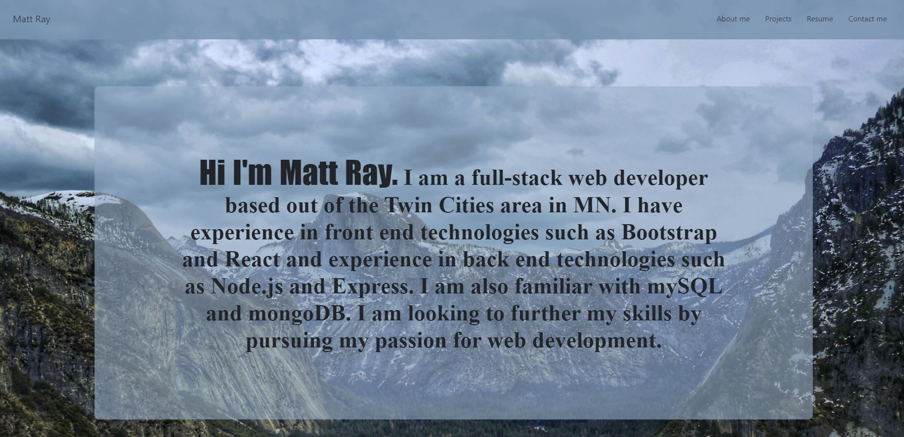
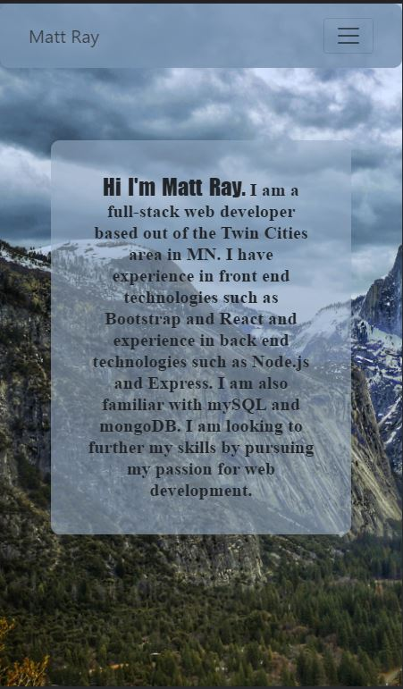
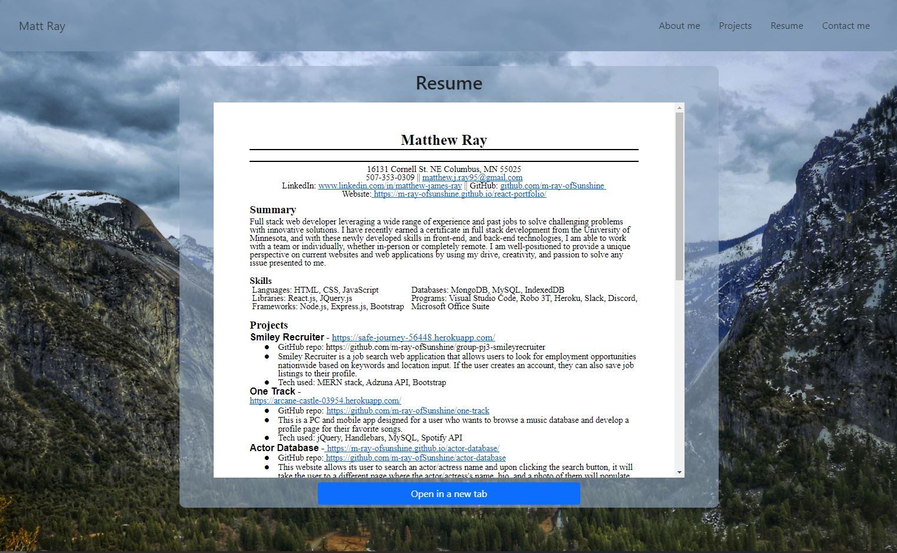
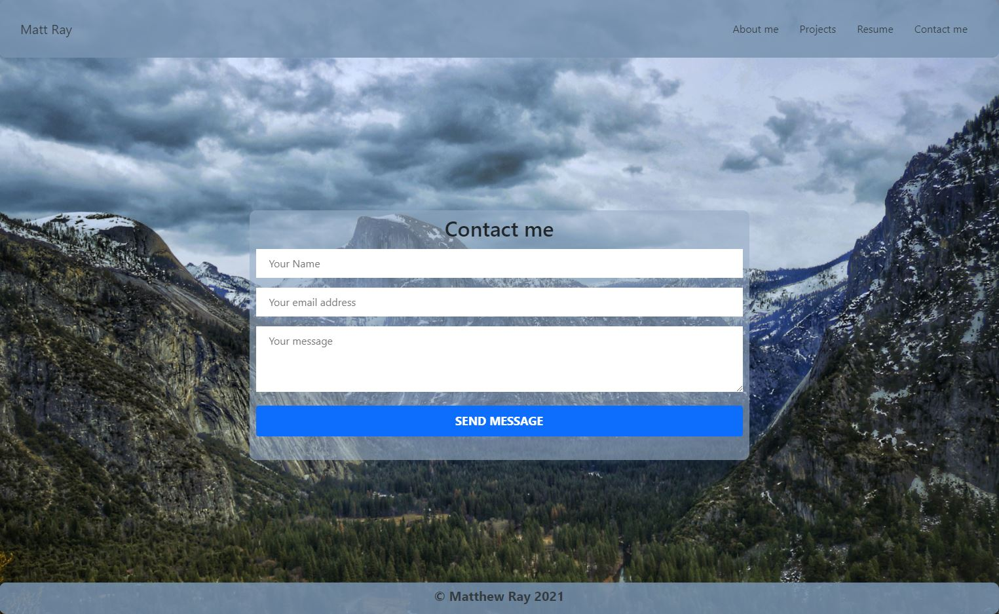

# React Portfolio

## Description

This is my main portfolio built using ```React.JS```


## Table of Contents

- [Description](#description)
- [Installation](#installation)
- [Usage](#usage)
- [Questions](#questions)

## Installation

In CLI type :
```
npm install
```

## Usage

The website is to showcase my ability as a Web Developer. There are 4 main sections:

    * About me (Brand Statement)
    * Projects (Carousel of projects with working links)
    * Resume (iframe and link to view in another tab)
    * Contact form (Sends me an email with message and sender info. This will not expose my email)

This website is fully responsive and has function links that scroll to the different sections. The contact form is completely functional. 

Deployed web app : [https://m-ray-ofsunshine.github.io/react-portfolio/](https://m-ray-ofsunshine.github.io/react-portfolio)

## Images








## Questions

If you have any questions you can find me on Github at [m-ray-ofSunshine](https://github.com/m-ray-ofSunshine)


